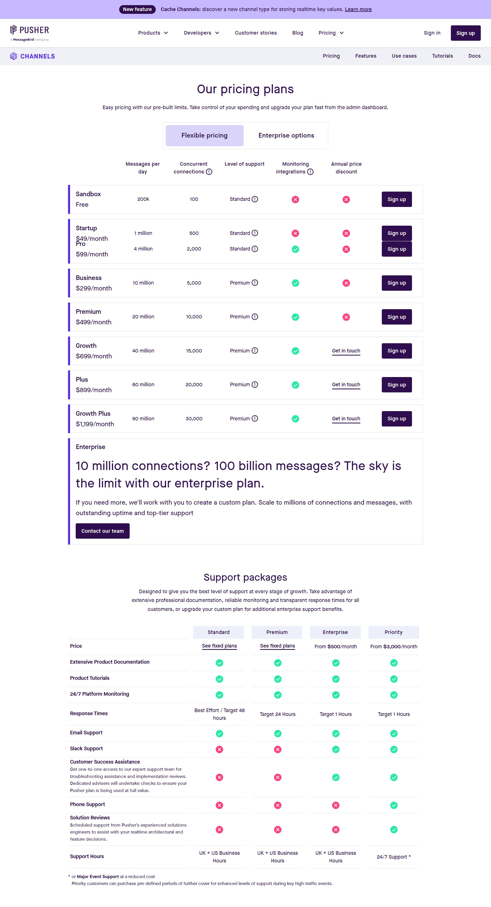
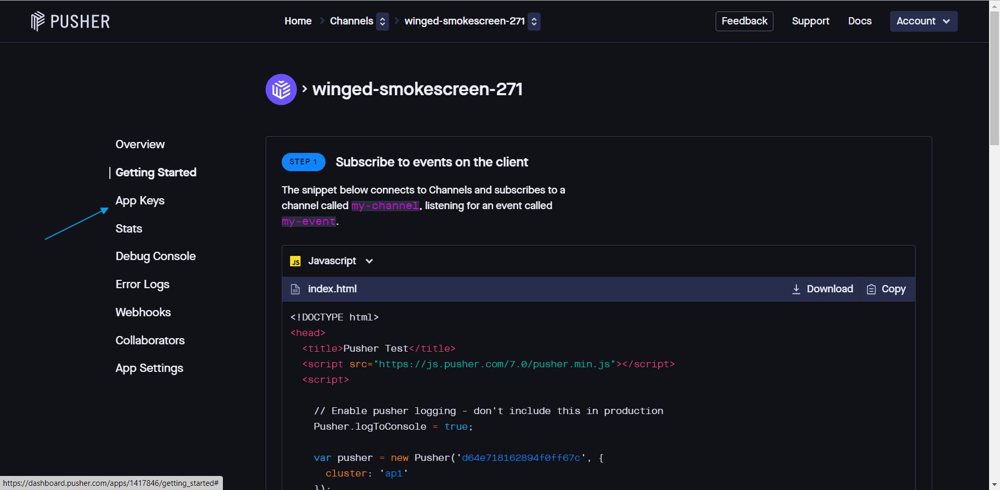
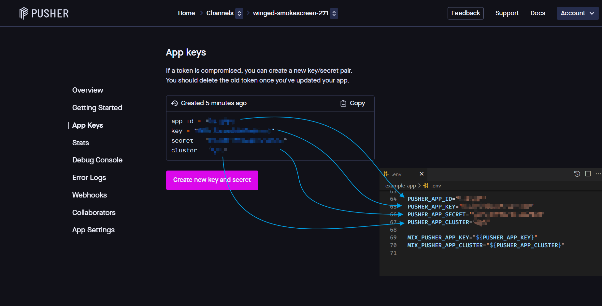

# How to create Free Account in Pusher

[Pusher](https://pusher.com) is hosted API service to have *Realtime Experience* without needing to refresh browser.

First, we enter [Pusher](https://pusher.com) website and click *Pricing > Channels* ...

As you can see, there are many options for us to choose. 

Now, We will use it in sample project so 200k messages per day is hopefully enough for that project. That's why we will choose **Sandbox Free** to sign up.

After Account Sign Up finished,  
You need to click **Create app** button.

①　your project name  
②　select your cluster (for me, I chose ap1 (Asia Pacific (Singapore)))  
*For Optional, Choose what you will use for it in Front end and Back end*  
③　After that, click **Create app** button.

After created app, you can see **Getting Started** screen. For Laravel, you need App keys of [Pusher](https://pusher.com) so click **App Keys**.

And then, copy your App Keys in Laravel **env** file.

[Go Back](../README.md)